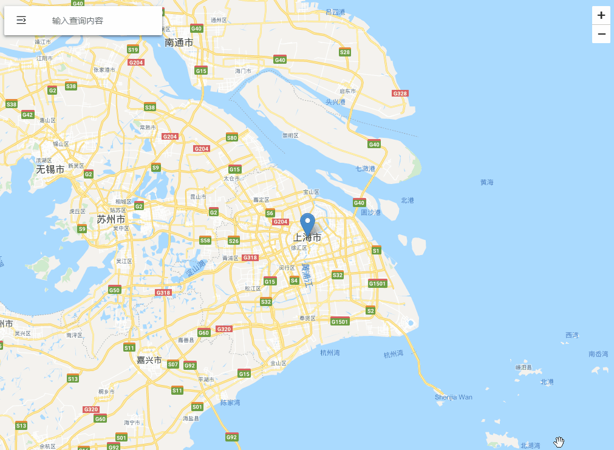

# react-leaflet-google-places-searchBox
React-Leaflet plugin for Google Places SearchBox, Support for custom menus.
## Installation
    npm install --save react-leaflet-google-places-searchbox
## Usage
Make sure you have Google Places library with valid Google API key loaded on page.
``` html
<script src="https://maps.googleapis.com/maps/api/js?key=<key>&libraries=places"></script>
```
```
<link rel="stylesheet" href="//cdnjs.cloudflare.com/ajax/libs/leaflet/1.3.0/leaflet.css">
```
``` javascript
import AutoSearch from 'react-leaflet-google-places-searchbox';
```
Extract from the example, including the business code, which needs to be modified according to the specific situation
``` javascript
import {Map} from 'react-leaflet';
import AutoSearch from 'react-leaflet-google-places-searchbox';
const unfoldIcon = require('../../img/menu_unfold.svg');
<Map
  center={this.props.leafletStore.centerLatlng}
  zoom={this.props.leafletStore.zoom}
  zoomControl={false}
  onClick={this.onMapClick}
  ref='map'
  onViewportChanged={viewport => this.props.leafletStore.setViewportChange(viewport)}
  style={styleObj}
  >
    <AutoSearch
    unfoldIcon={unfoldIcon}
    handleClickSearchIcon={() => this.props.leafletStore.setShowMenu(true)}
    updateLocation={(lat, lng) => this.props.leafletStore.setMakerPosition({lat, lng})}
    />
</Map>
```
## API
| Option | Default | Description |
| :----: | :----: | :----: |
| position | topleft | any valid LeafLet [position](http://leafletjs.com/reference.html#control-positions) |
| handleClickSearchIcon | - | The function of the searchbox icon. If it does not exist, the icon will not be displayed. |
| updateLocation | - | After searching for a location, what needs to be done besides pan the map to found position，The parameter is(place.geometry.location.lat(),place.geometry.location.lng()) |
| unfoldIcon | - | the icon of searchbox |

## Demo
There is a demo in the project. Fill in the googlekey in the leafletmapview file with a valid value,You can execute ***npm test*** to test locally.



## References
 [leaflet-google-places-autocomplete](https://github.com/Twista/leaflet-google-places-autocomplete)
